# V4 Big Five Module Dependency Map

Last updated: 2026-05-25

## Mermaid Graph

Solid arrows are Python imports inside `src/`. Dotted arrows point to external
artifact directories used by the v4 workflow.

```mermaid
graph TD
  subgraph controls
    N1["src/controls/__init__.py"]
    N2["src/controls/vector_controls.py"]
    N41["src/steering/__init__.py"]
    N42["src/steering/extractor.py"]
    N43["src/steering/injector.py"]
    N44["src/steering/vector.py"]
  end
  subgraph data
    N3["src/data/__init__.py"]
    N4["src/data/bfi.py"]
    N5["src/data/trait_convert.py"]
    N6["src/data/trait_dataset.py"]
  end
  subgraph demo
    N7["src/demo/__init__.py"]
    N8["src/demo/bigfive_app.py"]
    N9["src/demo/bigfive_demo_data.py"]
    N10["src/demo/bigfive_demo_validation.py"]
    N11["src/demo/live_inference.py"]
    N12["src/demo/live_inference_tab.py"]
  end
  subgraph evaluation
    N13["src/evaluation/__init__.py"]
    N14["src/evaluation/agreement.py"]
    N15["src/evaluation/as_metrics.py"]
    N16["src/evaluation/bigfive_analysis.py"]
    N17["src/evaluation/bigfive_metrics.py"]
    N18["src/evaluation/distribution.py"]
    N19["src/evaluation/layer_analysis.py"]
    N20["src/evaluation/loglik_selector.py"]
    N21["src/evaluation/paraphrase_robustness.py"]
    N22["src/evaluation/quantization_compare.py"]
    N23["src/evaluation/side_effect_metrics.py"]
  end
  subgraph experiments
    N24["src/experiments/__init__.py"]
    N25["src/experiments/manifest.py"]
    N26["src/experiments/v4_bigfive_phase2_validation.py"]
    N27["src/experiments/v4_bigfive_phase3_validation.py"]
    N28["src/experiments/v4_bigfive_plan.py"]
    N29["src/experiments/v4_bigfive_readiness.py"]
    N30["src/experiments/v4_bigfive_runner.py"]
  end
  subgraph generation
    N31["src/generation/__init__.py"]
    N32["src/generation/generator.py"]
    N33["src/generation/parser.py"]
    N34["src/generation/prompt_builder.py"]
  end
  subgraph models
    N35["src/models/__init__.py"]
    N36["src/models/hooks.py"]
    N37["src/models/loader.py"]
  end
  subgraph projection
    N38["src/projection/__init__.py"]
    N39["src/projection/embedder.py"]
    N40["src/projection/selector.py"]
  end
  subgraph utils
    N0["src/__init__.py"]
    N45["src/utils/__init__.py"]
    N46["src/utils/config.py"]
    N47["src/utils/seed.py"]
  end
  subgraph external
    DATA["data/"]
    CONFIGS["configs/"]
    RESULTS["results/"]
  end

  N5 --> N4
  N6 --> N4
  N8 --> N9
  N8 --> N11
  N8 --> N12
  N10 --> N9
  N11 --> N6
  N11 --> N30
  N11 --> N32
  N11 --> N34
  N11 --> N37
  N11 --> N43
  N12 --> N6
  N12 --> N9
  N12 --> N11
  N21 --> N16
  N23 --> N33
  N26 --> N28
  N26 --> N29
  N27 --> N4
  N27 --> N26
  N27 --> N28
  N27 --> N29
  N28 --> N2
  N28 --> N4
  N28 --> N6
  N28 --> N25
  N28 --> N34
  N28 --> N46
  N29 --> N4
  N29 --> N6
  N29 --> N28
  N29 --> N44
  N30 --> N2
  N30 --> N4
  N30 --> N6
  N30 --> N17
  N30 --> N20
  N30 --> N32
  N30 --> N34
  N30 --> N39
  N30 --> N40
  N30 --> N43
  N30 --> N44
  N36 --> N37
  N39 --> N37
  N42 --> N37
  N43 --> N37
  N43 --> N44
  N47 --> N46

  N4 -.-> DATA
  N5 -.-> DATA
  N6 -.-> DATA
  N8 -.-> DATA
  N8 -.-> RESULTS
  N9 -.-> DATA
  N10 -.-> RESULTS
  N11 -.-> DATA
  N11 -.-> CONFIGS
  N11 -.-> RESULTS
  N16 -.-> RESULTS
  N21 -.-> RESULTS
  N23 -.-> RESULTS
  N25 -.-> RESULTS
  N28 -.-> DATA
  N28 -.-> CONFIGS
  N28 -.-> RESULTS
  N29 -.-> DATA
  N29 -.-> CONFIGS
  N29 -.-> RESULTS
  N30 -.-> DATA
  N30 -.-> CONFIGS
  N30 -.-> RESULTS

  classDef data fill:#d7f0ff,stroke:#22709a,color:#111
  classDef models fill:#ffe1cc,stroke:#a95f24,color:#111
  classDef controls fill:#e1f7d5,stroke:#4c8a2f,color:#111
  classDef projection fill:#efe1ff,stroke:#7852a9,color:#111
  classDef generation fill:#fff3bf,stroke:#a88400,color:#111
  classDef evaluation fill:#ffd6e7,stroke:#a43a68,color:#111
  classDef experiments fill:#dbe4ff,stroke:#4765a8,color:#111
  classDef demo fill:#d3f9d8,stroke:#2f8f46,color:#111
  classDef external fill:#f1f3f5,stroke:#868e96,stroke-dasharray: 5 5,color:#111
  class N3,N4,N5,N6 data
  class N35,N36,N37 models
  class N1,N2,N41,N42,N43,N44 controls
  class N38,N39,N40 projection
  class N31,N32,N33,N34 generation
  class N13,N14,N15,N16,N17,N18,N19,N20,N21,N22,N23 evaluation
  class N24,N25,N26,N27,N28,N29,N30 experiments
  class N7,N8,N9,N10,N11,N12 demo
  class DATA,CONFIGS,RESULTS external
```

## Module Responsibilities

- `src/__init__.py`: 이 모듈은 `src` 패키지 경계를 담당한다.
- `src/controls/__init__.py`: 이 모듈은 control 패키지 노출을 담당한다.
- `src/controls/vector_controls.py`: 이 모듈은 v4 vector-control 조건 해석을 담당한다.
- `src/data/__init__.py`: 이 모듈은 data 패키지 노출을 담당한다.
- `src/data/bfi.py`: 이 모듈은 BFI-44 item loading과 Big Five 자기보고 점수화를 담당한다.
- `src/data/trait_convert.py`: 이 모듈은 raw TRAIT 데이터를 v4 내부 schema로 변환하는 일을 담당한다.
- `src/data/trait_dataset.py`: 이 모듈은 normalized TRAIT scenario loading과 contrastive pair 생성을 담당한다.
- `src/demo/__init__.py`: 이 모듈은 demo 패키지 경계를 담당한다.
- `src/demo/bigfive_app.py`: 이 모듈은 Streamlit demo shell과 탭 통합을 담당한다.
- `src/demo/bigfive_demo_data.py`: 이 모듈은 demo용 scenario, response, fallback data를 담당한다.
- `src/demo/bigfive_demo_validation.py`: 이 모듈은 demo readiness check를 담당한다.
- `src/demo/live_inference.py`: 이 모듈은 live model loading, AS generation, PAS cosine diagnostic을 담당한다.
- `src/demo/live_inference_tab.py`: 이 모듈은 live inference Streamlit UI를 담당한다.
- `src/evaluation/__init__.py`: 이 모듈은 evaluation 패키지 경계를 담당한다.
- `src/evaluation/agreement.py`: 이 모듈은 speech-action agreement metric을 담당한다.
- `src/evaluation/as_metrics.py`: 이 모듈은 legacy AS behavior metric을 담당한다.
- `src/evaluation/bigfive_analysis.py`: 이 모듈은 v4 결과 CSV 집계, 차이 계산, bootstrap report 생성을 담당한다.
- `src/evaluation/bigfive_metrics.py`: 이 모듈은 Big Five consistency와 target-attainment metric을 담당한다.
- `src/evaluation/distribution.py`: 이 모듈은 action distribution 분석을 담당한다.
- `src/evaluation/layer_analysis.py`: 이 모듈은 layer sweep 결과 시각화와 요약을 담당한다.
- `src/evaluation/loglik_selector.py`: 이 모듈은 action 후보의 conditional log-likelihood 선택을 담당한다.
- `src/evaluation/paraphrase_robustness.py`: 이 모듈은 paraphrase robustness 집계를 담당한다.
- `src/evaluation/quantization_compare.py`: 이 모듈은 fp16과 4bit steering vector 비교를 담당한다.
- `src/evaluation/side_effect_metrics.py`: 이 모듈은 generated response의 format, length, parsing side-effect를 담당한다.
- `src/experiments/__init__.py`: 이 모듈은 experiment 패키지 경계를 담당한다.
- `src/experiments/manifest.py`: 이 모듈은 reproducible run manifest 생성을 담당한다.
- `src/experiments/v4_bigfive_phase2_validation.py`: 이 모듈은 Phase 2 pilot readiness 검증을 담당한다.
- `src/experiments/v4_bigfive_phase3_validation.py`: 이 모듈은 Phase 3 final-run readiness 검증을 담당한다.
- `src/experiments/v4_bigfive_plan.py`: 이 모듈은 v4 설계 산출물과 config/data 구조 검증을 담당한다.
- `src/experiments/v4_bigfive_readiness.py`: 이 모듈은 v4 실행 전 입력 파일, split, vector 상태 점검을 담당한다.
- `src/experiments/v4_bigfive_runner.py`: 이 모듈은 BFI scoring, TRAIT scoring, AS/PAS scoring row 생성을 담당한다.
- `src/generation/__init__.py`: 이 모듈은 generation 패키지 경계를 담당한다.
- `src/generation/generator.py`: 이 모듈은 Hugging Face model의 text generation wrapper를 담당한다.
- `src/generation/parser.py`: 이 모듈은 generated NPC response에서 speech와 action tag 파싱을 담당한다.
- `src/generation/prompt_builder.py`: 이 모듈은 scenario와 persona를 chat/action-choice prompt로 변환하는 일을 담당한다.
- `src/models/__init__.py`: 이 모듈은 models 패키지 경계를 담당한다.
- `src/models/hooks.py`: 이 모듈은 model forward hook lifecycle helper를 담당한다.
- `src/models/loader.py`: 이 모듈은 model/tokenizer loading과 transformer layer resolution을 담당한다.
- `src/projection/__init__.py`: 이 모듈은 projection 패키지 경계를 담당한다.
- `src/projection/embedder.py`: 이 모듈은 action text를 hidden-state embedding으로 변환하는 일을 담당한다.
- `src/projection/selector.py`: 이 모듈은 persona vector와 action embedding 간 cosine ranking을 담당한다.
- `src/steering/__init__.py`: 이 모듈은 steering 패키지 경계를 담당한다.
- `src/steering/extractor.py`: 이 모듈은 contrastive pair에서 activation을 추출하는 일을 담당한다.
- `src/steering/injector.py`: 이 모듈은 transformer layer output에 AS vector를 주입하는 일을 담당한다.
- `src/steering/vector.py`: 이 모듈은 steering vector 계산, 정규화, 저장/로드를 담당한다.
- `src/utils/__init__.py`: 이 모듈은 utils 패키지 경계를 담당한다.
- `src/utils/config.py`: 이 모듈은 YAML config loading과 병합을 담당한다.
- `src/utils/seed.py`: 이 모듈은 random seed 고정을 담당한다.

## Entry Point Trace: `src/experiments/v4_bigfive_runner.py`

1. Config load: runner 자체는 runtime helper이며, 실행 scripts가 YAML config를 읽고 runner 함수에 model, data path, condition을 전달한다. 관련 책임은 `src/utils/config.py`, `src/experiments/manifest.py`, `src/experiments/v4_bigfive_plan.py`가 나눠 가진다.
2. Data load: BFI item은 `src/data/bfi.py`, TRAIT scenario는 `src/data/trait_dataset.py`가 읽고 runner는 scoring 가능한 row로 변환한다.
3. Model load: 실행 script가 `src/models/loader.py`로 model/tokenizer를 준비하고, runner는 `TextGenerator`와 scoring helper에 전달한다.
4. Core loop: runner가 condition별로 BFI self-report, TRAIT log-likelihood 선택, optional AS hook, optional PAS cosine diagnostic을 순서대로 호출한다.
5. Result save: runner의 row writer와 manifest helper가 `bfi_scores.csv`, `trait_scores.csv`, `consistency_metrics.csv`, `pas_loglik_agreement.csv`, `run_manifest.json` 형태로 `results/`에 저장한다.

## Hot Modules

- `src/data/bfi.py` is imported by 6 modules: `src/data/trait_convert.py`, `src/data/trait_dataset.py`, `src/experiments/v4_bigfive_phase3_validation.py`, `src/experiments/v4_bigfive_plan.py`, `src/experiments/v4_bigfive_readiness.py`, `src/experiments/v4_bigfive_runner.py`.
- `src/data/trait_dataset.py` is imported by 5 modules: `src/demo/live_inference.py`, `src/demo/live_inference_tab.py`, `src/experiments/v4_bigfive_plan.py`, `src/experiments/v4_bigfive_readiness.py`, `src/experiments/v4_bigfive_runner.py`.
- `src/models/loader.py` is imported by 5 modules: `src/demo/live_inference.py`, `src/models/hooks.py`, `src/projection/embedder.py`, `src/steering/extractor.py`, `src/steering/injector.py`.
- `src/demo/bigfive_demo_data.py` is imported by 3 modules: `src/demo/bigfive_app.py`, `src/demo/bigfive_demo_validation.py`, `src/demo/live_inference_tab.py`.
- `src/experiments/v4_bigfive_plan.py` is imported by 3 modules: `src/experiments/v4_bigfive_phase2_validation.py`, `src/experiments/v4_bigfive_phase3_validation.py`, `src/experiments/v4_bigfive_readiness.py`.

## Verification

- Mermaid syntax was checked with a local restricted parser for declared nodes, edges, classes, and dotted external links.
- `src/` Python coverage: 48 of 48 files appear in the graph.
- Internal import coverage: 50 of 50 AST-detected `src.*` imports appear as solid edges.
- Runner chain coverage: `v4_bigfive_runner.py` reaches 13 internal modules in the graph and every reached module is declared.
- Missing modules: none.
